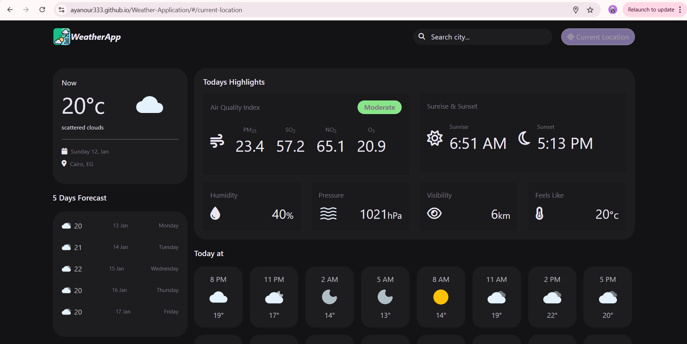

# Weather App 🌦️

A fully functional weather application built with **JavaScript**, providing accurate real-time weather updates and search functionality. This project demonstrates my ability to create dynamic and reliable web applications.



## 🚀 Features

- **Real-Time Weather Updates**: Displays accurate weather conditions for any location.
- **Search Functionality**: Users can search for weather by city or region.
- **Location-Based Weather**: Automatically fetches and displays weather based on the user's current location.
- **Responsive Design**: Works seamlessly on various devices and screen sizes.
- **Optimized JavaScript**: Efficient and clean code ensures smooth performance.


## 🔧 Technologies Used

- **HTML5**: For the structure of the web app.
- **CSS3**: For beautiful and responsive styling.
- **JavaScript (ES6+)**: Handles app logic, API integration, and UI interactions.
- **OpenWeather API**: Provides real-time and accurate weather data.


## 🖥️ How to Run Locally

1. Clone this repository:
   ```bash
   git clone https://github.com/AyaNour333/Weather-Application.git
   cd Weather-Application
